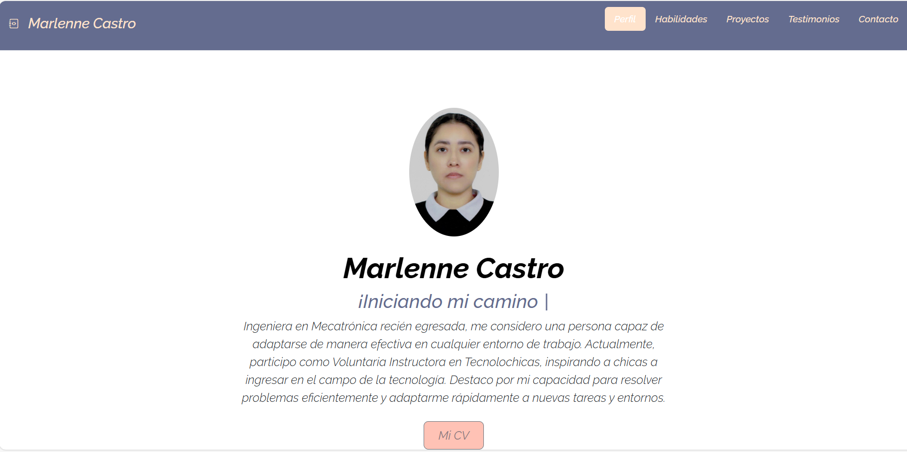

## Portafolio de Proyectos
¡Hola! Soy **Marlenne Castro**, ingeniera mecatrónica, desarrolladora web Jr. Buscando crecer y aportar mi granito de arena en la comunidad de mujeres STEM, aquí encontrarás información sobre mí.
___
### El proyecto cuenta con las secciones de:
- 🏆 Habilidades 
- 📚 Proyectos
- ✍ Testimonios 
- 📩 Contacto 
---
### Creado con
- HTML 
- CSS 
- JavaScript 
----
### Vista previa

---
### **¡Espero colaboremos pronto!**
*Correo:* [marlenne.castro13@gmail.com](mailto:marlenne.castro13@gmail.com)
___
### Creado en el Bootcamp de TecnolochicasPRO 💜 [Tecnolochicas](https://tecnolochicas.mx/)